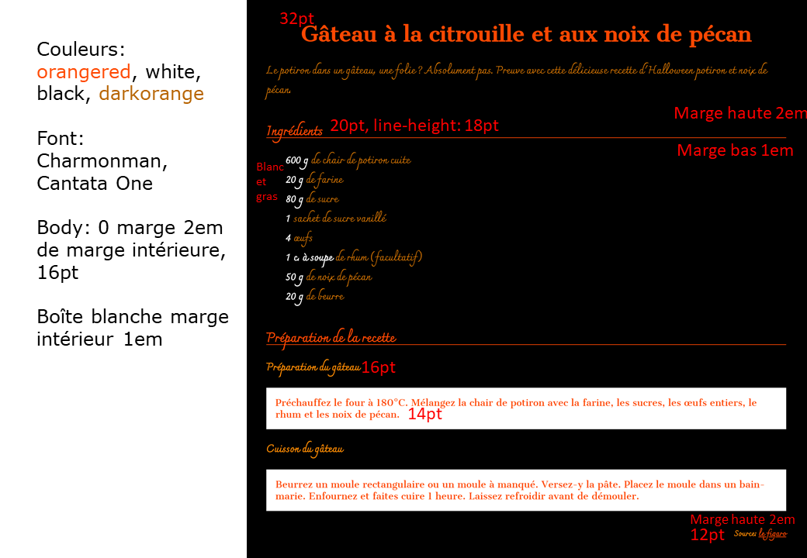

# Exercice: Recette (CSS Basic)

Ouvrir le projet dans [codesanbox.io](https://codesandbox.io/s/github/bfritscher/cours-html-exercices/tree/master/CSS_Basic_Recette)

Créer un fichier css et faire le lien depuis le HTML.

Ecrire les règles CSS pour retrouver l'état final en suivant les instuctions.

**SANS MODIFIER la partie body du HTML!**

Utiliser: google-fonts, couleurs, espacement, ...

Après avoir validé votre syntaxe HTML avec https://validator.w3.org/ et CSS avec https://jigsaw.w3.org/css-validator/ vous pouvez valider l'exercice sur https://html.bf0.ch/#recette .