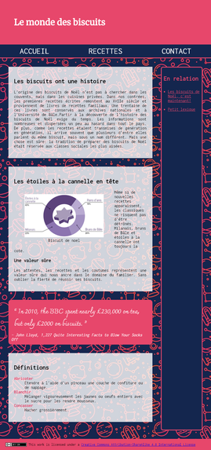

# Exercice: Biscuits (CSS avancé)

Ouvrir le projet dans [codesanbox.io](https://codesandbox.io/s/github/bfritscher/cours-html-exercices/tree/master/CSS_Flexbox_Biscuits)

A l'aide des fichiers et informations fournies on vous demande de finir le site pour ressembler au <a href="#resultat">résultat voulut</a>.

Une partie du HTML et CSS est donnée, à vous de compléter. Pour vous aider voici le <a href="#croquis">croquis</a> initial de la personne qui a commencé à programmer la page, <a href="texte.txt">le texte source</a> et quelques annotations :

- Les polices utilisées dans la pages sont: Merriweather|Inconsolata|Charmonman

- Les couleurs utilisées dans la pages sont: #14264E, #E7476B

- Le titre de la page est "Le monde des biscuits".

- Il est également affiché dans l'en tête de la page.

- La barre de navigation principal comporte 3 liens href="#" avec les textes: Accueil, Recettes, Contact.
    **Ils sont écrit tel quelle, mais affiché en majuscule.**

- Quand la souris passe sur un lien la couleur de fond de celui-ci est la même que l'entête.

- On utilise le div.two_columns pour partager la page en deux colonnes de ratio 4/1. Il occupe lui-même tout l'espace disponible de la hauteur de la page qui n'est pas utilisé par l'entête ou le pied de page.

- L'image dans l'article doit être ajouté avec une figure et le texte doit passer autour de l'image. La figure doit au maximum faire 300px de large, tandis que l'image elle-même prend toujours toute la place disponible dans la figure.

- La dernière partie avant la fin de la page est une section avec une liste de définition.

- L'aparté à une bordure de 3px et des bord arrondie de 8px.

- Dans le pied de page l'image doit être aligné au texte.

<h2 id="croquis">Croquis</h2>

<h2 id="resultat">Résultat</h2>

Après avoir validé votre syntaxe HTML avec https://validator.w3.org/ et CSS avec https://jigsaw.w3.org/css-validator/ vous pouvez valider l'exercice sur https://html.bf0.ch/#biscuits .
