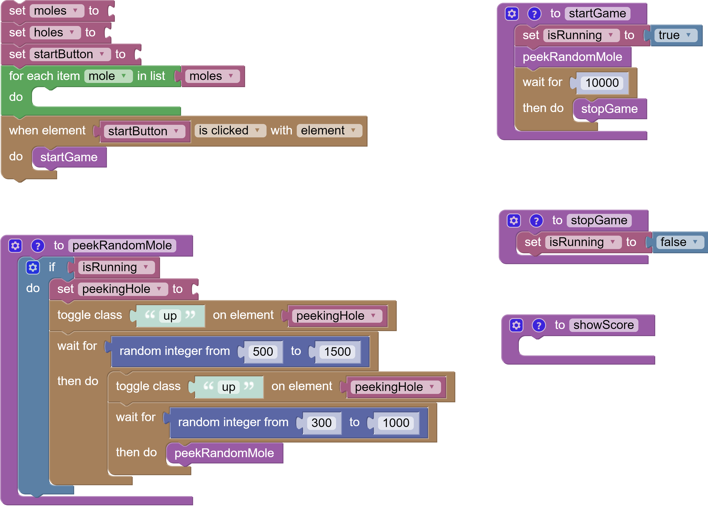

# Blockly DOM Whack-a-Mole Basic

Ouvrir le projet dans [codesanbox.io](https://codesandbox.io/s/github/bfritscher/cours-html-exercices/tree/master/DOM_Whack-a-Mole_Basic)

Regarder les id et class dans `index.html`, et écrire le code blockly (liens *Open Blockly Editor*, en bas à gauche de la page).

## Compléter la logique du jeux

Sélectionner les bon éléments DOM et les stocker dans les variables appropriées.

Pour chaque `mole` faire que si on clique dessus la classe `up` est enlevée sur l'élément parent (pour la faire se cacher). Et incrémenter le score de 1.

Compléter la fonction `startGame` pour afficher la classe running sur le body.

Remettre le score à 0 et l’afficher.

`showScore` doit afficher le contenu de la variable `score` dans le DOM.

`stopGame` doit cacher la classe `running`.

`peekRandomMole` doit récupérer un élément hole aléatoirement dans la liste des holes.

### Assets source

 https://github.com/wesbos/JavaScript30/tree/master/30%20-%20Whack%20A%20Mole