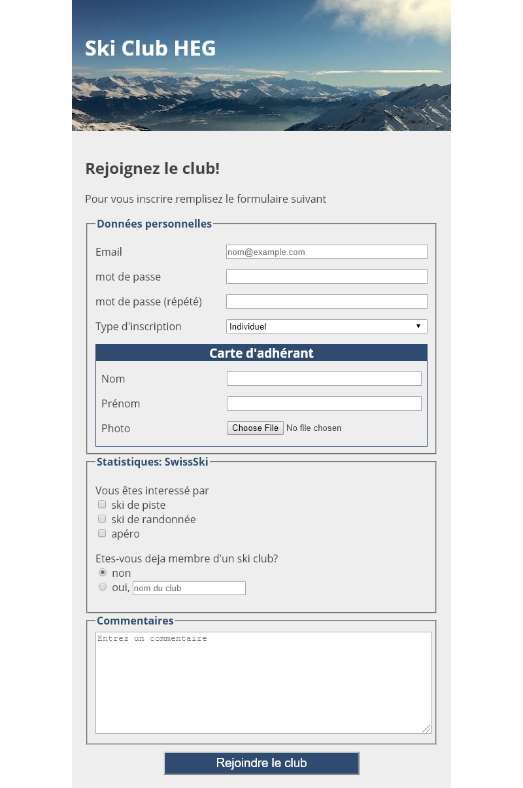

# Exercice: Ski Club (HTML Formulaire)

Ouvrir le projet dans [codesanbox.io](https://codesandbox.io/s/github/bfritscher/cours-html-exercices/tree/master/HTML_Form_SkiClub)

A l'aide des fichiers et informations fournies on vous demande de finir le site pour ressembler au résultat voulut.

Une partie du HTML et CSS est donnée, à vous de compléter. Pour vous aider voici quelques informations supplémentaires:

- Il faut regarder les selecteur CSS pour retrouver les balises HTML à utiliser
- La couleur du bleu utilisé est: #2F4B6F
- Le formulaire doit envoyer sont contenu à l'adresse "https://hec.unil.ch/info1ere/echo/"
- La première section du formulaire à l'id=info
- La partie Carte d'adhérant est faite grâce à une section id=carte
- Les noms techniques des éléments du formulaire sont les suivants: "email", "mdp1", "mdp2", "type", "nom", "prenom", "photo", "ski_piste", "ski_rando", "apero", "deja_skiclub", "deja_skiclub", "autre_skiclub", "commentaire"
- autre_skiclub et commentaire sont les deux seules éléments du formulaire sans légende
- La zone commentaire fait au minimum 150px de haut

Le résultat final doit ressembler à:

 

Après avoir validé votre syntaxe HTML avec https://validator.w3.org/ et CSS avec https://jigsaw.w3.org/css-validator/ vous pouvez valider l'exercice sur https://html.bf0.ch/#skiclub .
