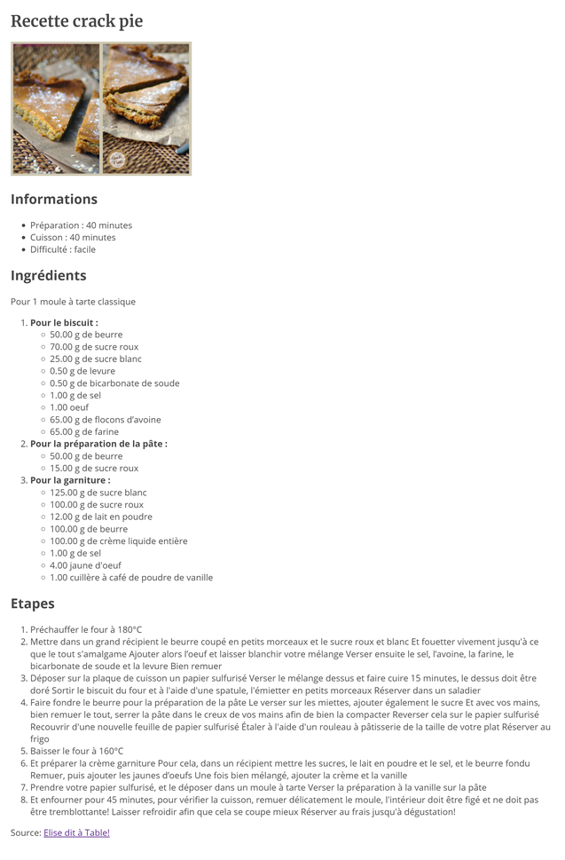

# Exercice: Crackpie (HTML Listes)

Ouvrir le projet dans [codesanbox.io](https://codesandbox.io/s/github/bfritscher/cours-html-exercices/tree/master/HTML_Listes_Crackpie)

Utiliser le contenu du fichier [recette.txt](recette.txt) pour compléter la page [index.html](index.html) avec des balises de titres, paragraphes, listes, image et lien.

Le résultat final doit ressembler à:

 

Après avoir validé votre syntaxe HTML avec https://validator.w3.org/ vous pouvez valider l'exercice sur https://html.bf0.ch/#crackpie .
