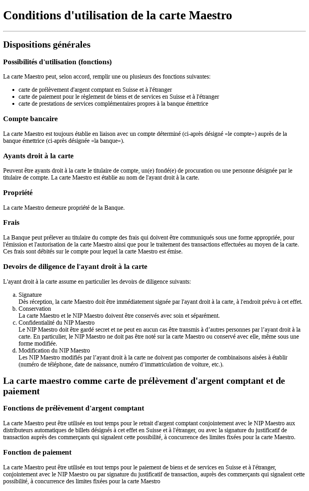

# Exercice: Maestro (HTML Texte)

Ouvrir le projet dans [codesanbox.io](https://codesandbox.io/s/github/bfritscher/cours-html-exercices/tree/master/HTML_Texte_Maestro)

Utiliser le contenu du fichier [Conditions et règlements.txt](Conditions%20et%20règlements.txt) pour compléter la page [index.html](index.html) avec des balises de titres, paragraphes et listes. Le titre affiché dans l'onglet du navigateur est le nom utilisé pour le fichier txt.

Le résultat final doit ressembler à:

 

Après avoir validé votre syntaxe HTML avec https://validator.w3.org/ vous pouvez valider l'exercice sur https://html.bf0.ch/#maestro .
